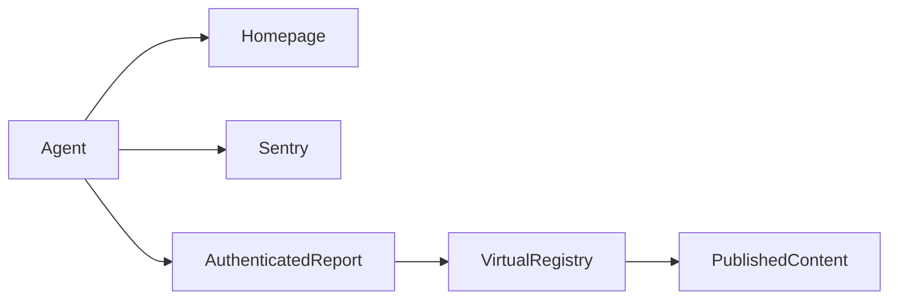

# Daily check-in

Use `@harlan-zw/nuxt-checkin@0.2.0` and `@harlan-zw/nuxt-sentry@0.1.6` from the registry.
The lockfile pins the published shared CLI release.

Set `NUXT_CHECKIN_TOKEN` in the Worker and `CHECKIN_TOKEN` in the agent environment.
Set `NUXT_CHECKIN_DEPLOYMENT` to the deployed commit if the build does not provide `GITHUB_SHA`.
Set `CHECKIN_DEPLOYMENT` from deployment evidence before each external run.
The endpoint rejects missing authentication and missing deployment identity.

Run `pnpm checkin` with `SENTRY_AUTH_TOKEN` containing read access.
Sentry covers every retained unresolved issue in `harlanzw-com`, across environments.
The runner checks homepage status and validates the authenticated content report's identity and freshness.
A nonzero exit means a warning, failure, or incomplete coverage requires attention.

The content check uses the same query API and published filter as the feed.
It checks archive availability and feed metadata without rendering every article or fetching GitHub metadata.
Add checks through `server/checks/*.ts` and maintain required IDs in `shared/checkin.ts`.
There are no existing system-health emails in this site.

## Shared CLI

Run `pnpm checkin` to prepare the registered checks and execute the shared CLI.
Add external checks in `checks/external/*.ts`.
Keep required external IDs in `shared/checkin-external.ts`.
The module owns report validation, response limits, deadlines, JSON output, and exit codes.
Server checks stay behind the authenticated route.
